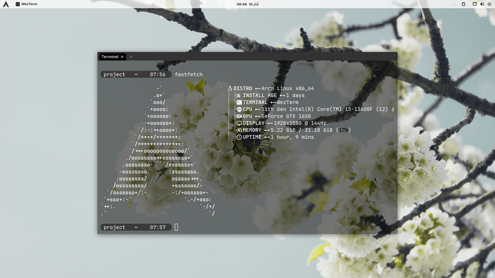

# myTerminal 

In this repository, I've included my terminal configuration files to improve and personalize my terminal experience across different operating systems. The configurations include visual enhancements, command-line tools, and customized prompts.

## Features ✨
- **Neofetch**: A command-line system information tool. 🖥️
- **WezTerm**: A GPU-accelerated cross-platform terminal emulator and multiplexer. 🚀
- **bashrc**: A customized `.bashrc` file for the bash shell. 🐚
- **Starship**: The minimal, blazing-fast, and infinitely customizable prompt for any shell. 🌟

## Installation 🛠️

### WezTerm 

#### Linux 🐧

To install WezTerm on Linux via Flatpak, use the following command:
```bash
flatpak install flathub org.wezfurlong.wezterm
```

### WezTerm Configuration

```bash
mkdir -p ~/.config/wezterm
nvim ~/.config/wezterm/wezterm.lua
```
and paste my WezTerm profile into the file.

### Bashrc Configuration

```bash
nvim ~/.bashrc
```
and paste my bashrc profile into the file.

### Starship Configuration

```bash
nvim ~/.config/starship.toml
```
and paste my Starship profile into the file.

### Neofetch Configuration

```bash
nvim ~/.config/neofetch/config.conf
```
and paste my Neofetch profile into the file.
